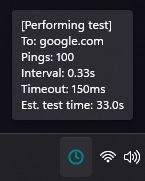

# PingTest
Simple and clean system tray icon that shows you the state of the conection with data and coloured icons to refelct it states. It uses multithreading to continuously perform a ping test in the background, with each iteration updating the system tray icon to reflect the current status of the test.
Below are some screenshots showcasing the program's system tray colour changing depending on your internet stability:

